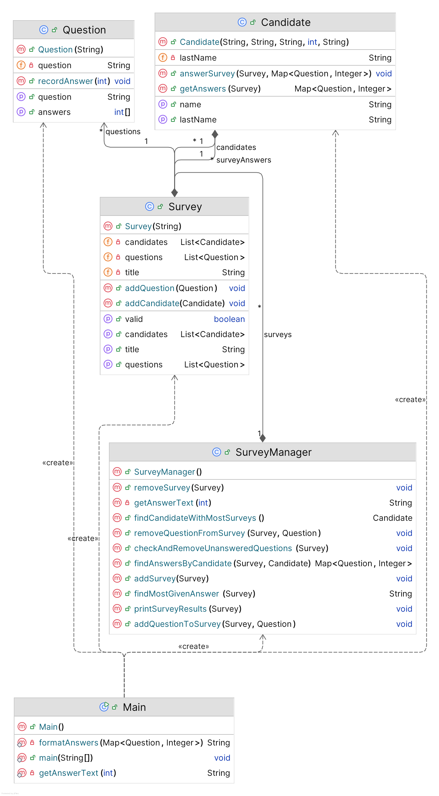

## LHIND java internship

### [GitHub Repository](https://github.com/BTabaku/lhind-java-internship)

## Exercise 1

```
Write a Java application which can manage survey data. The application needs to fulfill the following requirements:

• A survey can have multiple Questions, and can be taken by multiple candidates. A survey also has general survey information such as Title, Topic, Description.
• Each question has the possible alternatives which can be selected and the candidates can either choose one of the alternatives or decide not to answer a question.
  o The alternatives are the same for every question:
     Agree
     Slightly Agree
     Slightly Disagree
     Disagree
• Each candidate has the personal information such as First Name, Last Name, Email, Phone Number etc.
• The application should implement the following functions given the data structure described above:
  o Find the most given answer on a survey.
  o Print a survey’s result (meaning the number of each answer for each question)
  o Find the answers given by a candidate on a survey.
  o Find the candidate who has taken the most surveys.
  o Add/remove a question to an existing survey.
  o Checks if a question is answered by less than 50% of the candidates and then remove it from the survey.
  o Validates the survey:
     Must have at least 10 questions.
     Can have at most 40 questions.
     Each question has to be unique.
```

### Exercise 1 - UML

